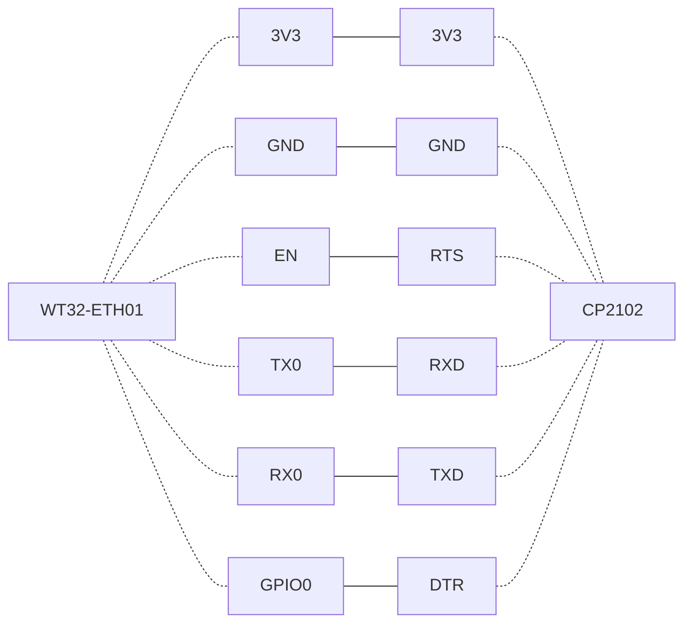
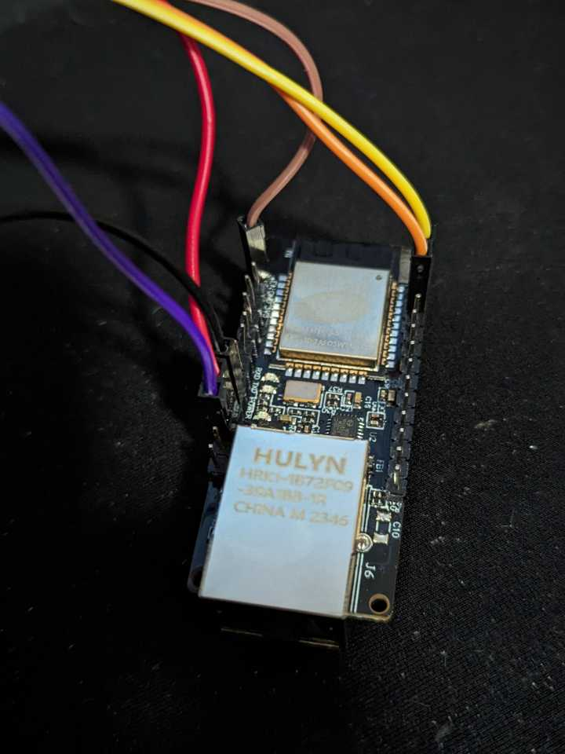
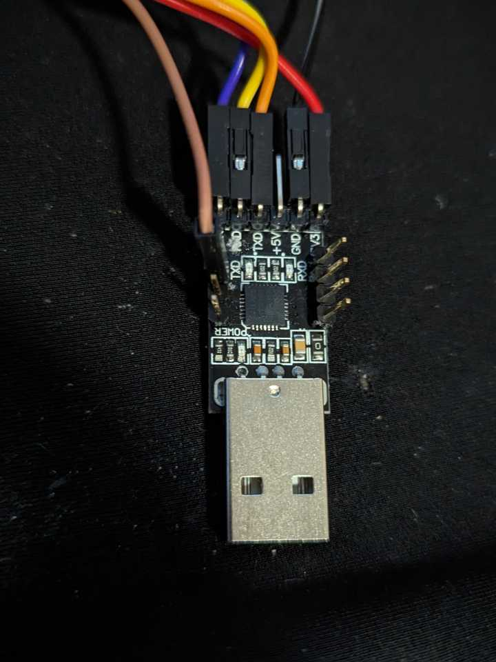
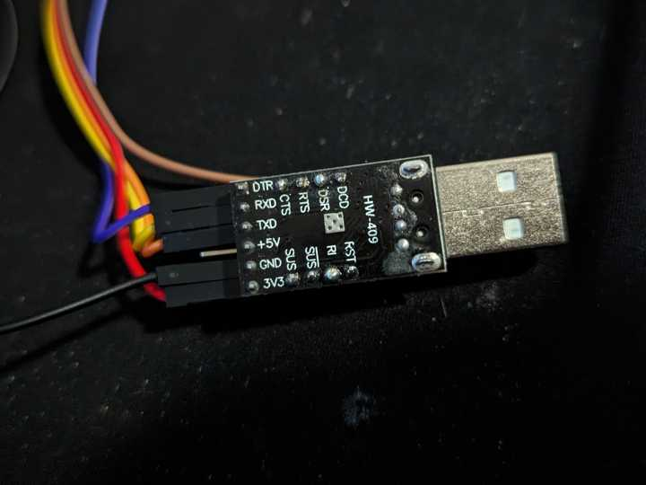
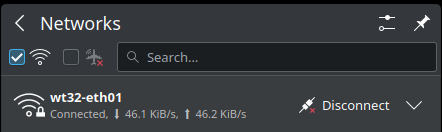

# esp32-wap

ESP32 Wireless access point on `WT32-ETH01` bridged with the Ethernet port using ESP32 ESP-IDF.

## What is this project code?

- A working installation of the bridge example in the ESP-IDF example code, copied from `$IDF_PATH/examples/network/bridge`.
- Modified to work with the `WT32-ETH01` module.
- Bridges the Ethernet interface with the ESP32 WiFi access point.

## Installation

### Prerequisites

You need:

- A working [ETH-IDF](https://docs.espressif.com/projects/esp-idf/en/latest/esp32/get-started/) installation.
- A [WT32-ETH01](https://en.wireless-tag.com/product-item-2.html) module.
- A USB-serial module. Mine is a [HW-409](https://www.aliexpress.us/item/3256805710563717.html) CP2102-based module with many uncommon lines available, like `RTS` and `CTS`. I had to solder an extra pin header to get access to these uncommon signals, though.

### Get this project's code

```sh
git clone https://github.com/moriartynz/esp32-wap.git
```

### Editing `sdkconfig`

- The `sdkconfig` file in the root directory of the project can be edited to customise a number of things. When changes are made, the project will need to be re-built and flashed.

WiFi Access Point:

```
CONFIG_EXAMPLE_BR_WIFI_SSID="wt32-eth01"
CONFIG_EXAMPLE_BR_WIFI_PASSWORD="mybridgepassword"
CONFIG_EXAMPLE_BR_WIFI_CHANNEL=1
CONFIG_EXAMPLE_BR_MAX_STA_CONN=10
```

You can edit these manually in the file or use the following command after using the `export.sh` command in the next heading:

```sh
idf.py menuconfig
```

### `ESP-IDF` building

From the `esp32-wap` directory, issue the following commands/do these things:

```sh
. ../esp32/esp-idf/export.sh
```

> replace `../esp32/esp-idf` with your actual location of the `esp-idf` installation on your computer.
>
> My setup is in Linux. If you are running MS-Windows or some other operating system, you can use the appropriate export script for your operating system.

```sh
idf.py fullclean
```

```sh
idf.py build
```

### Flashing

#### Wiring connection

You need to wire up the `WT32-ETH01` to the serial module. For mine, this is how it was accomplished:



I used the 3.3V power from the serial module to power the `WT32-ETH01`.

Here is is wired up:


Notice that purple wire. It's on the **wrong pin**. I quickly inserted it to take the photo, and put it in the wrong place. It should be on the `GPIO0` pin next to the orange wire. ***Don't make this mistake, magic purple smoke may ensue!***

Here's my wired-up `HW-409` serial module:



- Plug in the serial module into the computer.

```sh
idf.py flash
```

+ With some serial modules, you may encounter issues with your serial device name not being autodetected, and will have to manually specify the device for the `flash` command: `idf.py -p /dev/ttyYourDevice flash`.
- Power cycle the `WT32-ETH01` (I just unplugged the 3.3V power pin for a few seconds).

```sh
idf.py monitor
```

+ This will bring up a scroll of a series of reboot messages, including the following (in red):

  ```log
  E (673) eth_phy_802_3: esp_eth_phy_802_3_pwrctl(244): power up timeout
  E (673) eth_phy_802_3: esp_eth_phy_802_3_basic_phy_init(413): power control failed
  E (673) lan87xx: lan87xx_init(341): failed to init PHY
  E (683) esp_eth: esp_eth_driver_install(229): init phy failed
  E (683) example_eth_init: eth_init_internal(94): Ethernet driver install failed
  E (693) example_eth_init: example_eth_init(249): internal Ethernet init failed
  ```
- With the device still powered on and monitor still running, unplug the `DTR` line from `GPIO0`. This should now boot correctly and stop the endless reboot loop. See the `Gotchas` below for more information about why this is necessary.

## Testing

### Power Consumption

All running off the 5V USB power supply. Baseline current is 15 mA for the USB power meter + serial module.

Idle current = 220 ­– 240 mA (incl. everything) = 205 – 225 mA for the `WT32-ETH0` module alone. This is a power-hungry little beast, especially given it's not actually doing anything!

### Basic connectivity testing

For testing, this was the setup:


Success!


### Benchmark results

I did a [speed test](https://speedtest.net) from the computer over the WT32-ETH01 WiFi Access Point (about 10 cm away).

The results: about **8 Mbps download** and **18 Mbps upload**. Power consumption was pretty much the same as at idle.


A fair number of transmit errors were encountered:

```log
E (1665543) esp.emac: emac_esp32_transmit(233): insufficient TX buffer size
E (1665603) esp.emac: emac_esp32_transmit(233): insufficient TX buffer size
E (1665733) esp.emac: emac_esp32_transmit(233): insufficient TX buffer size
E (1665823) esp.emac: emac_esp32_transmit(233): insufficient TX buffer size
E (1666353) esp.emac: emac_esp32_transmit(233): insufficient TX buffer size
E (1666613) esp.emac: emac_esp32_transmit(233): insufficient TX buffer size
```

## Notes

- Getting specifications on the `WT32-ETH01` board was a chore. I eventually found a schematic for it (I've put a copy of the schematic and the datasheet in the docs directory for ease of access).

## Why, just why would you do this little project?

- A bit of fun. I wanted to benchmark the device to see what it could do.
- If your Wireless AP dies and you have no other options available, you could give this a go as a temporary stand-in, I suppose. It's not quite as bad as dial-up, but it's certainly not going to win you any bandwidth medals or allow hundreds of devices to connect.

## Gotchas

### `LAN 8720A`

- While the `LAN 8720A` IC has a reset pin `nRST`, this is permanently pulled high on the `WT32-ETH01`.
- I could not get the PHY to work when disabling the PHY Reset GPIO number in the `sdkconfig` using `CONFIG_EXAMPLE_ETH_PHY_RST_GPIO=-1`.
- The workaround was to set `CONFIG_EXAMPLE_ETH_PHY_RST_GPIO=16` in the `sdkconfig`. This enables the `OSC50MHZ` 50 Mhz oscillator reference clock, and seems to reset the PHY too.

### `GPIO0`

- This pin has a dual function, so it's a bit of a dance to get it to work properly.
- The 50 MHz reference clock is supplied on the `GPIO0` line for synchronising with the ESP32 MAC with the PHY.
- However, to program the device, you need to connect `GPIO0` to `DTR` on the serial module.
- When you use `idf.py monitor`, you should see a lot of reboots and messages about `eth_phy_802_3: esp_eth_phy_802_3_pwrctl(244): power up timeout` (see above) with the programmer connected.
- To fix this issue, with the `WT32-ETH0` on, continuously rebooting and the monitor still running, unplug the `DTR` line from `GPIO0`.
- The device will reboot one more time and should then just work. The monitor function also continues to work too.

## A successful boot monitor log

```log
ets Jun  8 2016 00:22:57

rst:0xc (SW_CPU_RESET),boot:0x13 (SPI_FAST_FLASH_BOOT)
configsip: 0, SPIWP:0xee
clk_drv:0x00,q_drv:0x00,d_drv:0x00,cs0_drv:0x00,hd_drv:0x00,wp_drv:0x00
mode:DIO, clock div:2
load:0x3fff0030,len:7140
load:0x40078000,len:15500
load:0x40080400,len:4
0x40080400: _init at ??:?

load:0x40080404,len:3904
entry 0x40080640
I (29) boot: ESP-IDF v5.3-dev-582-gab03c2ea13 2nd stage bootloader
I (29) boot: compile time Dec 21 2023 19:20:03
I (31) boot: Multicore bootloader
I (35) boot: chip revision: v1.1
I (39) boot.esp32: SPI Speed      : 40MHz
I (43) boot.esp32: SPI Mode       : DIO
I (48) boot.esp32: SPI Flash Size : 2MB
I (52) boot: Enabling RNG early entropy source...
I (58) boot: Partition Table:
I (61) boot: ## Label            Usage          Type ST Offset   Length
I (69) boot:  0 nvs              WiFi data        01 02 00009000 00006000
I (76) boot:  1 phy_init         RF data          01 01 0000f000 00001000
I (84) boot:  2 factory          factory app      00 00 00010000 00100000
I (91) boot: End of partition table
I (95) esp_image: segment 0: paddr=00010020 vaddr=3f400020 size=27f48h (163656) map
I (160) esp_image: segment 1: paddr=00037f70 vaddr=3ffb0000 size=03d38h ( 15672) load
I (166) esp_image: segment 2: paddr=0003bcb0 vaddr=40080000 size=04368h ( 17256) load
I (173) esp_image: segment 3: paddr=00040020 vaddr=400d0020 size=9503ch (610364) map
I (383) esp_image: segment 4: paddr=000d5064 vaddr=40084368 size=136a8h ( 79528) load
I (426) boot: Loaded app from partition at offset 0x10000
I (427) boot: Disabling RNG early entropy source...
I (438) cpu_start: Multicore app
I (447) cpu_start: Pro cpu start user code
I (447) cpu_start: cpu freq: 160000000 Hz
I (447) cpu_start: Application information:
I (450) cpu_start: Project name:     try_idf
I (455) cpu_start: App version:      1
I (459) cpu_start: Compile time:     Dec 21 2023 19:19:53
I (465) cpu_start: ELF file SHA256:  1e6bcb428...
I (471) cpu_start: ESP-IDF:          v5.3-dev-582-gab03c2ea13
I (477) cpu_start: Min chip rev:     v0.0
I (482) cpu_start: Max chip rev:     v3.99
I (487) cpu_start: Chip rev:         v1.1
I (492) heap_init: Initializing. RAM available for dynamic allocation:
I (499) heap_init: At 3FFAE6E0 len 00001920 (6 KiB): DRAM
I (505) heap_init: At 3FFB7ED8 len 00028128 (160 KiB): DRAM
I (511) heap_init: At 3FFE0440 len 00003AE0 (14 KiB): D/IRAM
I (517) heap_init: At 3FFE4350 len 0001BCB0 (111 KiB): D/IRAM
I (524) heap_init: At 40097A10 len 000085F0 (33 KiB): IRAM
I (532) spi_flash: detected chip: generic
I (535) spi_flash: flash io: dio
W (539) spi_flash: Detected size(4096k) larger than the size in the binary image header(2048k). Using the size in the binary image header.
I (553) main_task: Started on CPU0
I (563) main_task: Calling app_main()
I (593) esp_eth.netif.netif_glue: 48:e7:29:a7:68:a7
I (593) esp_eth.netif.netif_glue: ethernet attached to netif
I (623) wifi:wifi driver task: 3ffc3374, prio:23, stack:6656, core=0
I (623) wifi:wifi firmware version: 4e1d70a
I (623) wifi:wifi certification version: v7.0
I (623) wifi:config NVS flash: enabled
I (623) wifi:config nano formating: disabled
I (633) wifi:Init data frame dynamic rx buffer num: 32
I (633) wifi:Init static rx mgmt buffer num: 5
I (643) wifi:Init management short buffer num: 32
I (643) wifi:Init dynamic tx buffer num: 32
I (643) wifi:Init static rx buffer size: 1600
I (653) wifi:Init static rx buffer num: 10
I (653) wifi:Init dynamic rx buffer num: 32
I (663) wifi_init: rx ba win: 6
I (663) wifi_init: tcpip mbox: 32
I (663) wifi_init: udp mbox: 6
I (673) wifi_init: tcp mbox: 6
I (673) wifi_init: tcp tx win: 5760
I (673) wifi_init: tcp rx win: 5760
I (683) wifi_init: tcp mss: 1440
I (683) wifi_init: WiFi IRAM OP enabled
I (693) wifi_init: WiFi RX IRAM OP enabled
I (953) esp_netif_br_glue: 48:e7:29:a7:68:a7
I (953) esp_netif_br_glue: bridge netif glue attached
I (4953) phy_init: phy_version 4780,16b31a7,Sep 22 2023,20:42:16
I (4963) eth_bridge_example: Ethernet (0x3ffbe5dc) Started
I (5023) wifi:mode : softAP (48:e7:29:a7:68:a5)
I (5033) wifi:Total power save buffer number: 16
I (5033) wifi:Init max length of beacon: 752/752
I (5033) wifi:Init max length of beacon: 752/752
I (5103) br_config_console: Registering Bridge config commands.

Type 'help' to get the list of commands.
Use UP/DOWN arrows to navigate through command history.
Press TAB when typing command name to auto-complete.
I (5103) main_task: Returned from app_main()
bridge>
```
